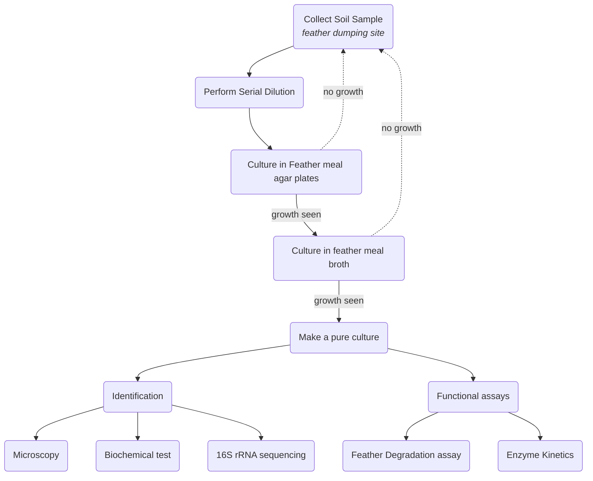

```mermaid
graph TD
A --> B
B --> C
C -- growth seen --> D
C-.->|no growth|A
D--growth seen-->E 
D-.->|no growth|A
E-->G
E-->K
G-->H
G-->I
G-->J
K-->L
K-->M
A(Collect Soil Sample <br> <i> feather dumping site)
B(Perform Serial Dilution)
C(Culture in Feather meal agar plates)
D(Culture in feather meal broth)
E(Make a pure culture)
G(Identification)
H(Microscopy)
I(Biochemical test)
J(16S rRNA sequencing)
K(Functional assays)
L(Feather Degradation assay)
M(Enzyme Kinetics)


```

